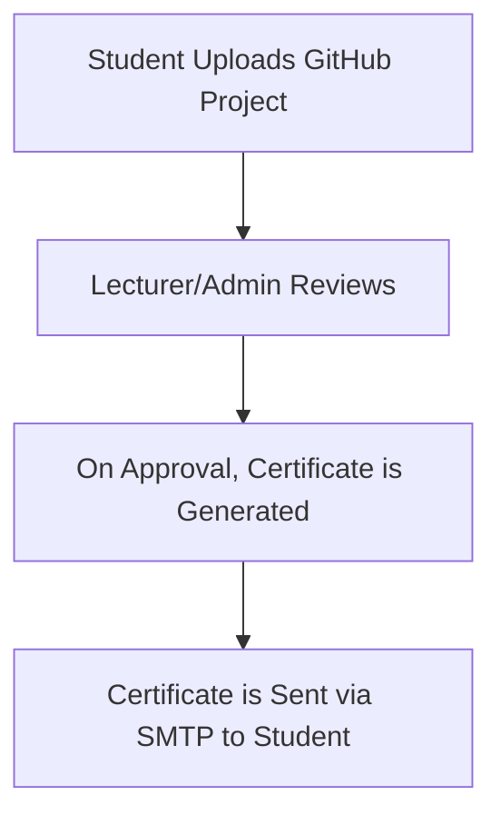

<p align="center">
  
</p>

<h1 align="center">🎓 Certificate Generator Web App</h1>

<p align="center">
  A powerful web app where students can upload their GitHub projects, get them reviewed, and receive a verified certificate via email — with complete role-based access and automated certificate delivery.
</p>

<p align="center">
  
  
  
  
  
</p>

---

## 🚀 Project Overview

✨ Upload GitHub project links with ease  
👥 Four distinct roles for seamless approval workflow  
📧 Automatic certificate generation + email delivery  
🛡️ Secure, elegant, and responsive Flask web app  
🤖 ChatGPT-assisted development

---

## 🧩 User Roles

| Role           | Description                                                            |
|----------------|------------------------------------------------------------------------|
| 👨‍🎓 Student       | Default role — uploads project links                                 |
| 👩‍🏫 Lecturer      | Reviews & approves projects in lecturer dashboard                    |
| 🛠️ Admin          | Can approve, edit users, view stats, manage dashboard                |
| 🧑‍💼 Super Admin   | Assigns roles to users and oversees entire platform                   |

---

## 📤 Certificate Approval Workflow



---

## 🛠️ Built With

- 🐍 Python + Flask  
- 💾 SQLite3 Database  
- 🎨 HTML5, CSS3, Bootstrap  
- ✉️ Flask-Mail for SMTP integration  

---

## 📁 Project Structure

```
📦 certificate-genrater/
├── static/
│   └── profile_pics/       # ⛔ Ignored in repo
├── templates/
│   ├── login.html
│   ├── dashboard.html
│   └── certificate.html
├── app.py                  # 🔥 Main Flask App
├── database.db             # 📦 SQLite DB (local only)
├── .env                    # 🔐 Hidden credentials
└── README.md               # 📖 This file
```

---

## 🔐 Security Features

- `.env` and `profile_pics/` are safely ignored via `.gitignore`
- SMTP credentials securely stored in environment
- Role-based access restricts actions to authorized users only

---

## 🧠 ChatGPT Involvement

This project was made efficient and professional with assistance from **ChatGPT**, including:

- Flask route logic and template design  
- Role-based access & security checks  
- SMTP-based emailing system  
- 📝 This animated, stylish `README.md`

---

## 📫 Author

**Rhushi Hebbar**  
📧 [rhushihebbar22@gmail.com](mailto:rhushihebbar22@gmail.com)  
🔗 [GitHub Profile](https://github.com/rhushihebbar07)

---

## ⚡ Future Enhancements

- 🌍 Live deployment on Render/Heroku  
- 🗃️ Certificate archive + search  
- 📈 Admin analytics dashboard  
- 🏆 Leaderboard and team project features  

---

## 📝 License

Licensed under the [MIT License](LICENSE).

> © 2025 Rhushi Hebbar. All rights reserved.
