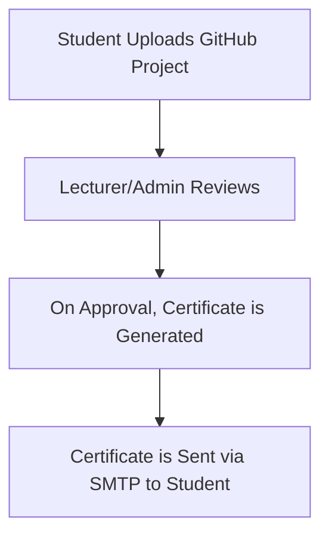

<p align="center">
  
</p>

<h1 align="center">🎓 Certificate Generator Web App</h1>

<p align="center">
  A powerful web app where students can upload their GitHub projects, get them reviewed, and receive a verified certificate via email — with complete role-based access and automated certificate delivery.
</p>

<p align="center">
  
  
  
  
  
</p>

---

## 🚀 Project Overview

- 🔗 Upload GitHub project link  
- 👥 Four powerful user roles with custom dashboards  
- 📨 Auto-generate & send certificates using SMTP  
- 🔐 Secure login, clean interface, and role access control  
- ⚡ Built efficiently with help from **ChatGPT**  

---

## 🧩 User Roles

| Role           | Permissions                                                           |
|----------------|------------------------------------------------------------------------|
| 👨‍🎓 Student       | Default role — uploads project link                                 |
| 👩‍🏫 Lecturer      | Reviews & approves projects via dashboard                           |
| 🛠️ Admin          | Can approve projects, view/edit registered users, manage dashboard |
| 🧑‍💼 Super Admin   | Assigns roles (Lecturer/Admin), oversees entire application         |

---

## 📤 Certificate Approval Workflow



---

## 🛠️ Built With

- 🐍 Python + Flask  
- 💾 SQLite3 Database  
- 🎨 HTML5, CSS3, Bootstrap  
- ✉️ Flask-Mail (SMTP Emailing)  

---

## 📁 Project Structure

```
📦 certificate-genrater/
├── static/
│   └── profile_pics/       # ⛔ Ignored in repo
├── templates/
│   ├── login.html
│   ├── dashboard.html
│   └── certificate.html
├── app.py                  # 🔥 Main Flask App
├── database.db             # 📦 SQLite DB (local only)
├── .env                    # 🔐 Hidden credentials
└── README.md               # 📖 This file
```

---

## 🔐 Security

- `.env` and `profile_pics/` are hidden via `.gitignore`  
- SMTP credentials are securely stored  
- Only authorized roles can approve or modify data  

---

## 🧠 ChatGPT Involvement

This project was developed with assistance and code-generation support from **ChatGPT**, including:

- Designing clean Flask routes and templates  
- Handling user role logic  
- Crafting the SMTP certificate delivery system  
- Writing this stylish, professional `README.md` 🎉  

---

## 📫 Author

**Rhushi Hebbar**  
📧 [rhushihebbar22@gmail.com](mailto:rhushihebbar22@gmail.com)  
🔗 [GitHub Profile](https://github.com/rhushihebbar07)

---

## ⚡ Future Enhancements

- 🌐 Deploy to Render/Heroku  
- 📥 Certificate archive history  
- 📊 Analytics dashboard for admin  
- 🎓 College-wide team collaboration & leaderboard  

---

## 📝 License

Licensed under the [MIT License](LICENSE).

> © 2025 Rhushi Hebbar. All rights reserved.
